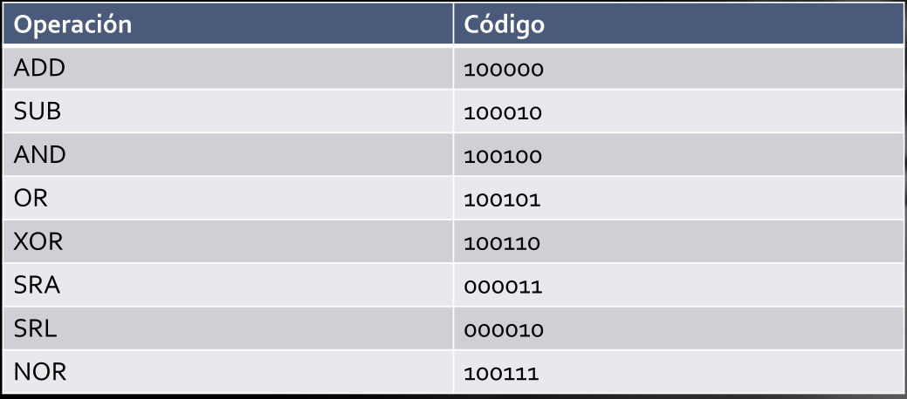
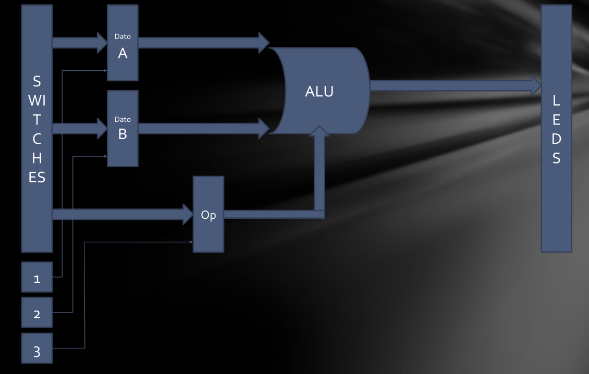
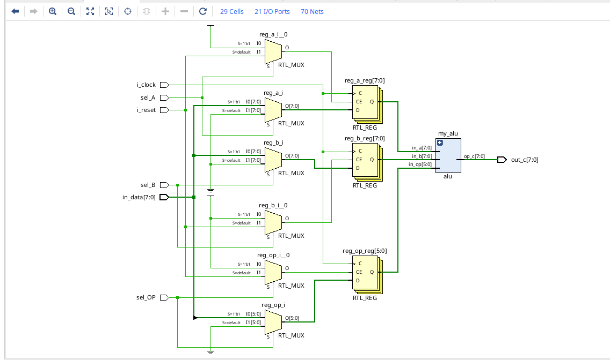
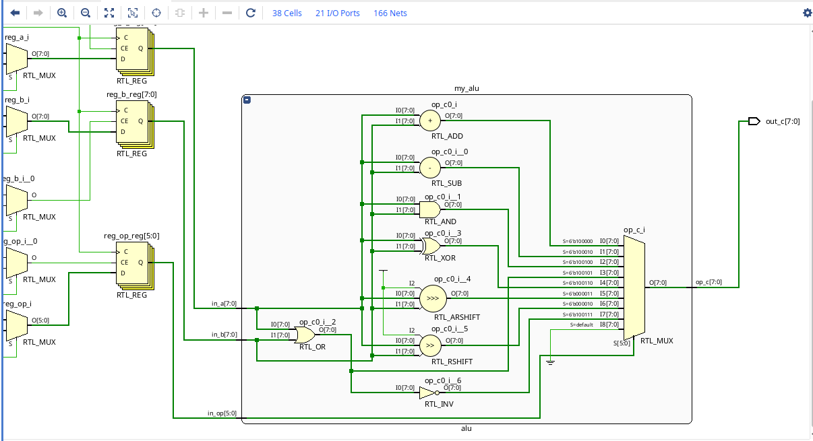

# UNIVERSIDAD NACIONAL DE CÓRDOBA
## Arquitectura de Computadoras 2025

### TP1 - ALU Parametrizable

* Alumnos:
    * Sleiman, Mohamad
    * Reyeros, Marcos

---
### CONSIGNA:

* Implementar en FPGA una ALU.
* La ALU debe ser parametrizable (bus de datos) para
poder ser utilizada posteriormente en el trabajo final.
* Validar el desarrollo por medio de Test Bench.
    * El testbench debe incluir generación de entradas
aleatorias y código de chequeo automático.
* Simular el diseño usando las herramientas de
simulación de vivado incluyendo análisis de tiempo.
* OPERACIONES:

* ALU:

---

### 1) Especificación de la ALU

Interfaz y parámetros

+ Parámetros: `N_BITS`, `OP_BITS`.

+ Puertos: `in_a`, `in_b`, `in_op`, `op_c`.

+ Convenciones: SRA aritmético con in_a signed, SRL lógico, sin flags.

### 2) Diagrama/bloques



Arquitectura: tres registros `reg_a`, `reg_b`, `reg_op` cargados con in_data por pulsos de `sel_A/B/OP`; reset síncrono; ALU combinacional; salida `out_c`.



### 3) Mapeo a la placa

+ Clock 100 MHz: pin W5, create_clock -period 10.

+ IOSTANDARD LVCMOS33 en todos los puertos.

```verilog
## Clock 100 MHz (Basys-3)
set_property PACKAGE_PIN W5 [get_ports i_clock]
set_property IOSTANDARD LVCMOS33 [get_ports i_clock]
create_clock -add -name sys_clk_pin -period 10.000 -waveform {0 5} [get_ports i_clock]

## Entradas: in_data[7:0] (SW0..SW7)
set_property PACKAGE_PIN V17 [get_ports {in_data[0]}]
set_property PACKAGE_PIN V16 [get_ports {in_data[1]}]
set_property PACKAGE_PIN W16 [get_ports {in_data[2]}]
set_property PACKAGE_PIN W17 [get_ports {in_data[3]}]
set_property PACKAGE_PIN W15 [get_ports {in_data[4]}]
set_property PACKAGE_PIN V15 [get_ports {in_data[5]}]
set_property PACKAGE_PIN W14 [get_ports {in_data[6]}]
set_property PACKAGE_PIN W13 [get_ports {in_data[7]}]
set_property IOSTANDARD LVCMOS33 [get_ports {in_data[*]}]

## Salidas: out_c[7:0] (LED7..LED0)
set_property PACKAGE_PIN V14 [get_ports {out_c[7]}]
set_property PACKAGE_PIN U14 [get_ports {out_c[6]}]
set_property PACKAGE_PIN U15 [get_ports {out_c[5]}]
set_property PACKAGE_PIN W18 [get_ports {out_c[4]}]
set_property PACKAGE_PIN V19 [get_ports {out_c[3]}]
set_property PACKAGE_PIN U19 [get_ports {out_c[2]}]
set_property PACKAGE_PIN E19 [get_ports {out_c[1]}]
set_property PACKAGE_PIN U16 [get_ports {out_c[0]}]
set_property IOSTANDARD LVCMOS33 [get_ports {out_c[*]}]

## Control 
set_property PACKAGE_PIN P18 [get_ports i_reset]
set_property PACKAGE_PIN P17 [get_ports sel_A]
set_property PACKAGE_PIN M18 [get_ports sel_B]
set_property PACKAGE_PIN N17 [get_ports sel_OP]
set_property IOSTANDARD LVCMOS33 [get_ports {i_reset sel_A sel_B sel_OP}]
```


| Señal           | Pin                                    | I/O Std  | Comentario           |
| --------------- | -------------------------------------- | -------- | -------------------- |
| `i_clock`       | W5                                     | LVCMOS33 | reloj 100 MHz        |
| `in_data[0..7]` | J15, L16, M13, R15, R17, T18, U18, R13 | LVCMOS33 | SW0..SW7             |
| `out_c[7..0]`   | H17, K15, J13, N14, R18, V17, U17, U16 | LVCMOS33 | LED7..LED0           |
| `i_reset`       | U18                                    | LVCMOS33 | botón/switch mapeado |
| `sel_A`         | W19                                    | LVCMOS33 | …                    |
| `sel_B`         | T18                                    | LVCMOS33 | …                    |
| `sel_OP`        | T17                                    | LVCMOS33 | …                    |

### 4) Verificación por simulación
```verilog
`timescale 1ns / 1ps

`define ADD 6'b10_0000
`define SUB 6'b10_0010
`define AND 6'b10_0100
`define OR  6'b10_0101
`define XOR 6'b10_0110
`define SRA 6'b00_0011
`define SRL 6'b00_0010
`define NOR 6'b10_0111

module tb_auto_alu();
    
    parameter N_BITS = 8;
    parameter OP_BITS = 6;
    
    parameter RETARDO = 20;
    parameter CANT_OPERACIONES = 8;

    reg [N_BITS-1:0] A;
    reg [N_BITS-1:0] B;
    reg [OP_BITS-1:0] SEL;
    wire [N_BITS-1:0] F; //salida de la ALU
    
    alu  #(N_BITS, OP_BITS)
    my_alu (
        .in_a(A), 
        .in_b(B), 
        .in_op(SEL), 
        .op_c(F)
    );
    

    reg [OP_BITS-1:0] operaciones [CANT_OPERACIONES-1:0]; //array para guardar los codigo de opearacion son 8 opreaciones 7 es un index no numero de bit.
   
    
    initial begin
    
        //CARGO OPERERACIONES PARA AUTO TEST
        operaciones[0] = `ADD;
        operaciones[1] = `SUB;
        operaciones[2] = `AND;
        operaciones[3] = `OR;
        operaciones[4] = `XOR;
        operaciones[5] = `SRA;
        operaciones[6] = `SRL;
        operaciones[7] = `NOR;
        
        #2000 $finish;
  
    end
       
 
 
    always begin
         
        #(RETARDO)
        
        //CARGO UN RANDOM EN LA ALU A
        A = $urandom;
        #(RETARDO)
        
        //CARGO UN RANDOM EN LA ALU B
        B = $urandom;
        #(RETARDO)
        
        //CARGO UNA OPERACION RANDOM EN LA ALU B DE 0 A 7 $random%8
        SEL = operaciones[$urandom%(CANT_OPERACIONES-1)];
        #(RETARDO)
           
        begin case(SEL) //LO ULTIMO QUE TENEMOS EN EL SWITCH ES LA OPERACION
        
        // my_alu.reg_a -> APUNTAMOS AL REGISTRO REG_A QUE ESTA DENTRO DE LA INSTANCIA DE my_alu
        
                `ADD:  if(F == (my_alu.in_a + my_alu.in_b)) 
                            $display("ADD correcto -> %h + %h = %h ", my_alu.in_a, my_alu.in_b, F );
                       else 
                            $display("ADD incorrecto -> %h + %h = %h", my_alu.in_a, my_alu.in_b, F );
                `SUB:  if(F == (my_alu.in_a - my_alu.in_b))
                            $display("SUB correcto -> %h - %h = %h ", my_alu.in_a, my_alu.in_b, F );
                       else 
                            $display("SUB incorrecto -> %h - %h = %h", my_alu.in_a, my_alu.in_b, F );
                `AND:  if(F == (my_alu.in_a & my_alu.in_b)) 
                            $display("AND correcto -> %d & %d = %d ", my_alu.in_a, my_alu.in_b, F );
                       else 
                            $display("AND incorrecto -> %d + %d = %d", my_alu.in_a, my_alu.in_b, F );
                `OR:   if(F == (my_alu.in_a | my_alu.in_b)) 
                            $display("OR correcto -> %d | %d = %d ", my_alu.in_a, my_alu.in_b, F );
                       else 
                            $display("OR incorrecto -> %d | %d = %d", my_alu.in_a, my_alu.in_b, F );                                 
                `XOR:  if(F == (my_alu.in_a ^ my_alu.in_b)) 
                            $display("XOR correcto -> %d ^ %d = %d ", my_alu.in_a, my_alu.in_b, F );
                       else 
                            $display("XOR incorrecto -> %d ^ %d = %d", my_alu.in_a, my_alu.in_b, F );
                `SRA:  if(F == (my_alu.in_a >>> my_alu.in_b)) 
                            $display("SRA correcto -> %b >>> %b = %b ", my_alu.in_a, my_alu.in_b, F );
                       else 
                            $display("SRA incorrecto -> %b >>> %b = %b", my_alu.in_a, my_alu.in_b, F );
                `SRL:  if(F == (my_alu.in_a >> my_alu.in_b)) 
                            $display("SRL correcto -> %d >> %d = %d ", my_alu.in_a, my_alu.in_b, F );
                       else 
                            $display("SRL incorrecto -> %d >> %d = %d", my_alu.in_a, my_alu.in_b, F );
                `NOR:  if(F == (my_alu.in_a | my_alu.in_b))
                            $display("NOR correcto -> %d | %d = %d ", my_alu.in_a, my_alu.in_b, F );
                       else 
                            $display("NOR incorrecto -> %d | %d = %d", my_alu.in_a, my_alu.in_b, F );
                endcase
        end
    end
```


### 5)CÓDIGO ALU

## top_alu
```verilog
`timescale 1ns / 1ps

//porque no tengo jitter cuando cambia la salida? VER SI HAY JITTER EN LA ALU

module top_alu
#(
    parameter N_BITS = 8,
    parameter OP_BITS = 6
)
(
    input  wire [N_BITS-1:0] in_data,
    input  wire sel_A,
    input  wire sel_B,
    input  wire sel_OP,
    input  wire i_clock,
    input  wire i_reset,
    output wire [N_BITS-1:0] out_c
   
);

// REGISTROS AUXILIARES PARA ALMACENAR VALORES QUE SE PASAN A LA ALU

    reg [N_BITS-1:0] reg_a;
    reg [N_BITS-1:0] reg_b;
    reg [OP_BITS-1:0] reg_op;

    
    
    //INSTANCIACION DE LA ALU
    
    alu    #(N_BITS, OP_BITS) 
    my_alu (
               .in_a(reg_a), 
               .in_b(reg_b), 
               .in_op(reg_op), 
               .op_c(out_c)
    ); 
    
    
    
    //CON LOS SIGUIENTE 3 BLOQUES ALWAYS EVITAMOS TENER UNA CADENA DE IF ELSE PARA LOS DATOS A, B Y C 

    always @(posedge i_clock) begin: DATOA
        if(sel_A) 
            begin
                reg_a <= in_data;
            end
        else if(i_reset) 
            begin
               reg_a <= {N_BITS{1'b0}};   //= 0         
            end
    end
    
    
    always @(posedge i_clock) begin: DATOB
        if(sel_B) 
            begin
                reg_b <= in_data;
            end
        else if(i_reset) 
            begin
               reg_b <= {N_BITS{1'b0}};   //= 0       
            end
    end
    
    
    always @(posedge i_clock) begin: OPERANDO
        if(sel_OP) 
            begin
                reg_op <= in_data; 
            end
        else if(i_reset) 
            begin
               reg_op <= {N_BITS{1'b0}};   //= 0                 
            end
    end


    
    /*  
    //NO SE DEBERIA HACER ESTO PORQUE ASOCIADMOS LOS REGISTROS A VARIOS BLOQUES ALWAYS. 
    
    always @(posedge clock) begin: RESET
        if(reset) begin
            reg_a  <= 8'b0000_0000;
            reg_b  <= 8'b0000_0000;
            reg_op <= 6'b0000_0000;
        end
    end    
    */


endmodule
```

## alu
```verilog
`timescale 1ns / 1ps

`define ADD 6'b10_0000 //32 -> 20 HEXA
`define SUB 6'b10_0010 //34 -> 22 HEXA
`define AND 6'b10_0100 //36 -> 24 HEXA
`define OR  6'b10_0101 //37 -> 25 HEXA
`define XOR 6'b10_0110 //38 -> 26 HEXA
`define SRA 6'b00_0011 //3 -> 3 HEXA
`define SRL 6'b00_0010 //2 -> 2 HEXA
`define NOR 6'b10_0111 //39 -> 27 HEXA


module alu
#(
    parameter N_BITS = 8,
    parameter OP_BITS = 6
)
(
   input wire[N_BITS-1:0] in_a,
   input wire[N_BITS-1:0] in_b,
   input wire[OP_BITS-1:0] in_op, //operacion
   output reg [N_BITS-1:0] op_c
);

    always @(*) begin: alu //ES COMBINACIONAL?
        case(in_op) //segun el valor de operacion hacemos una u otra cosa ASIGNANDO EL VALOR A C
            `ADD: op_c = in_a + in_b;
            `SUB: op_c = in_a - in_b;
            `AND: op_c = in_a & in_b;
            `OR:  op_c = in_a | in_b;
            `XOR: op_c = in_a ^ in_b;
            `SRA: op_c = $signed(in_a) >>> in_b;
            `SRL: op_c = in_a >> in_b;
            `NOR: op_c = ~(in_a | in_b);
            default: op_c = {N_BITS{1'b0}};//= 0    
        endcase
    end
    
endmodule
```