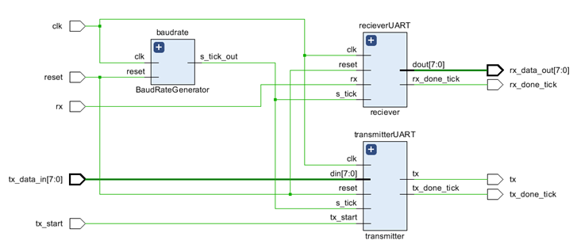
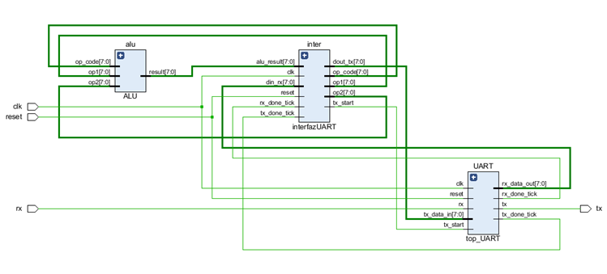

# UNIVERSIDAD NACIONAL DE CÓRDOBA
## Arquitectura de Computadoras 2025
### TP2 - UART

Alumnos:

   - Sleiman, Mohamad
   - Reyeros, Marcos

## Objetivo
Comprender el funcionamiento del protocolo **UART (Universal Asynchronous Receiver and Transmitter)** y analizar la **transmisión y recepción de datos asíncrona** entre dispositivos digitales.

---
## Comunicacion Asincrona 

La comunicación asíncrona es un método de transmisión en el que emisor y receptor no comparten una señal de reloj común. En vez de mantenerse sincronizados de forma permanente, cada trama incorpora su propia información de sincronización, lo que permite que ambos dispositivos intercambien datos sin necesitar una coordinación temporal continua. Por ejemplo, UART y RS-232.

A diferencia de la comunicación asíncrona, la **comunicacion síncrona** usa un reloj compartido para mantener emisor y receptor sincronizados durante toda la transmisión. Por ejemplo, SPI, I2C y USB.

## Comunicacion UART

UART (Universal Asynchronous Receiver/Transmitter) es un método de comunicación serie asíncrona que permite enviar datos bit a bit entre dos dispositivos sin usar una señal de reloj común. El emisor y receptor solo necesitan preacordar la velocidad de transmisión (baud rate), el tamaño de la trama de datos, cantidad de bits de stop y si la trama cuenta con bit de paridad.

### Trama UART 

Como se trata de una comunicación asíncrona, UART necesita una estructura fija para que el receptor pueda entender cada paquete de datos, esta estructura se llama trama (frame), y esta formada por:

   - Bit de **Start** --> Siempre es un 0 (nivel bajo) e indica que “empieza” un nuevo byte de datos.
   - **Bits de datos** --> Generalmente 7, 8 o 9 bits. Contiene el dato que se quiere transmitir
   - **Bit de paridad** (si aplica) --> Bit que sirve para detectar errores, el emisor lo genera y el receptor lo compara.
   - **Bits de Stop**  --> Pueden ser 1 o 2 bits, siempre en 1 (nivel alto). Indica que la trama termino.

## Modulos Receptor, Emisor y Baud Rate Generator

### Baud Rate Generator

El baud rate generator es un módulo clave que controla la velocidad de transmisión y recepción de la UART:
- Genera pulsos de reloj (ticks) a la frecuencia adecuada según la velocidad de transmisión acordada (baud rate), por ejemplo 9600, 115200
- El módulo Baud Rate Genetaror convierte la frecuencia del reloj principal en ticks uniformes para UART.
- El Baud Rate Generator genera estos ticks teniendo en cuenta el sobremuestreo (oversampling), usualmente 16. 
- La cantidad de ticks esta determinada por la formula ticks = clock / (baudrate * 16)
- El objetivo de estos tick es determinar cuándo muestrear o enviar cada bit en Rx y Tx:
   - El Tx usa los ticks para enviar bits a intervalos exactos.
   - El Rx usa los ticks para muestrear los bits en el centro y evitar errores de timing.

#### Sobremuestreo (oversalmpling)

El Baud Rate Generator genera estos ticks teniendo usando sobremuestreo (oversampling), que una técnica que mejora la precisión al leer los bits de datos.
Normalmente el valor de sobremuestreo que se adopta es 16, lo que significa que cada bit se muestrea 16 veces durante su duración, entonces el receptor toma estas 16 muestras equidistantes y decide que el valor que le asigna al bit en aproximadamente en la mitad, es decir, en el tick 8 (16/2).

La ventaja del sobremuestreo es que las pequeñas diferencias de reloj entre emisor y receptor no afectan la detección de bits. Y como el receptor toma muestras en el centro de cada bit (tick 8), evitamos errores por transición de señal.

  

### Emisor UART (TX)

El emisor UART se encarga de convertir los datos paralelos en serie y enviarlos por la línea de transmisión siguiendo la estructura de la trama:
- Genera el bit de inicio (0) para indicar el inicio de la trama
- Cargar el dato en un registro de desplazamiento (shift register).
- Cada bit se envía de manera secuencial siguiendo la duración establecida por el baud rate, el shift register desplaza un bit a la vez a la línea Tx.
- Si se usa paridad, el emisor genera un bit extra para detectar errores.
- Se agregan 1 o 2 bits de stop (nivel alto) al final de la trama.

### Receptor UART (RX)

El receptor UART recibe datos asíncronos bit a bit. Para interpretarlos correctamente, sigue una secuencia de estados:
- Monitorea la linea en espera (idle), que normalmente esta en alto.
- Cuando detecta un 0, sabe que empieza una nueva trama, es decir, detecta el bit de inicio, y se activa el contador de ticks para muestrear los bits siguientes.
- El receptor comienza a contar ticks que determinan cuando muestrear cada bit recibido (cada bit tiene una duración fija según la velocidad de transmisión determinada por el baud rate).
- Los bits de datos se van acumulando en un registro para formar el byte completo.
- Después de los datos (y la paridad si existe), el receptor espera los bits de stop (nivel alto).

5. **Representar mediante un diagrama de bloques** el sistema UART, incluyendo al menos:  
   - Generador de Baud Rate  
   - Transmisor (Tx)  
   - Receptor (Rx)  
   - Interfaz (INTF)  
   - Unidad aritmético-lógica (ALU)

## Nuestro proyecto

### Diagrama de bloques 

#### Del sistema UART

En nuestro proyecto la UART esta compuesta por los 3 modulos que se ven en el diagrama esquematico, baudrate, recieverUART y transmitterUART.

  

#### Diagrama de bloques del sistema completo UART ALU INTERFAZ:  

En el esquematico se muestra la interaccion de los distintos modulos, UART, ALU y INTERFAZ que se encarga de obtener los operandos del recieverUART, pasarselos a la ALU y enviar el resultado por el transmitterUART.

  

