# Introduction

### Introducción, breve historia – tendencias.

## Contenidos

* Desarrollo temprano de las computadoras.

* Arquitectura de computadoras.

* Tendencias en el rendimiento.

* Tendencias en la tecnología.

* Tendencias en energía y consumo de potencia.

* Medición del rendimiento.

* Ley de Amdahl.

* Ecuación de rendimiento del procesador.

## Desarrollo temprano de las computadoras

* Generación Cero: Máquinas de cálculo mecánicas.

* Primera generación: tubos de vacío.

* Segunda generación: transistores.

* Tercera generación: circuitos integrados.

* Última generación: VLSI (integración a muy gran escala).

### Primera generación: tubos de vacío

* 1946 – ENIAC (Integrador y Calculador Numérico Electrónico).

* Laboratorio de Investigación Balística.

* 18.000 tubos – 30 toneladas – 140 KW.

* 20 registros de 10 dígitos.

* 5000 sumas por segundo (200 µs).

### Primera generación: Von neuman

* Computadoras de programa almacenado.

* IAS – 1952.

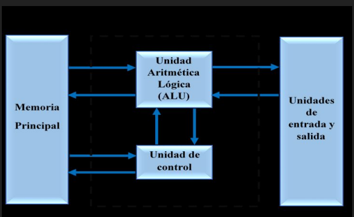

### Primera Generación: Desarrollos comerciales

* Eckert-Mauchly – Sperry-Rand: UNIVAC 1 (1951).

* IBM (1953): modelos 701, 702, 704, 705.

## Segunda generación: transistores

* IBM 7000.

* DEC PDP-1.

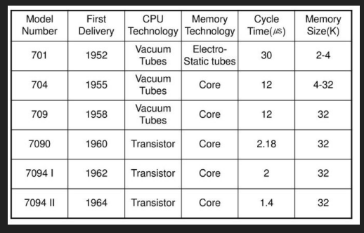
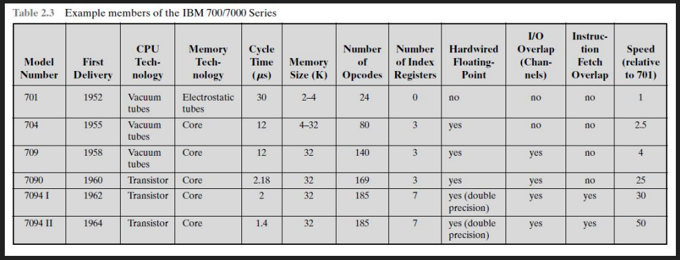

## Tercera generación: Circuitos Integrados

* IBM System/360.

* DEC PDP-8.

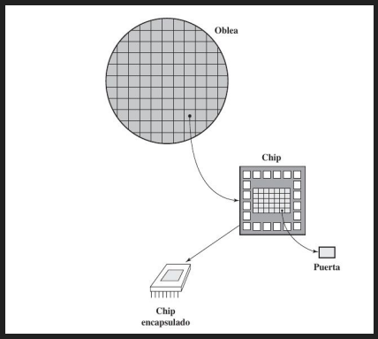

### Ley de Moore

* Velocidad de procesamiento.

* Precio.

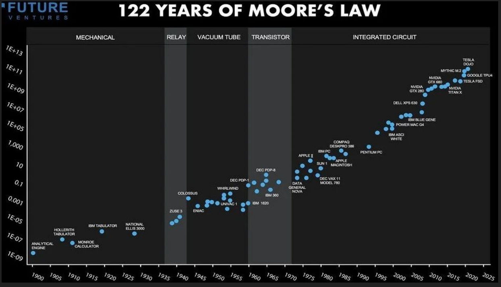

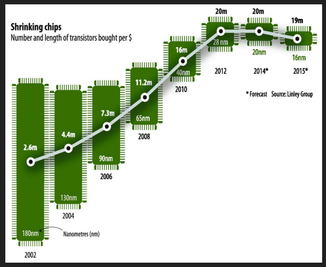

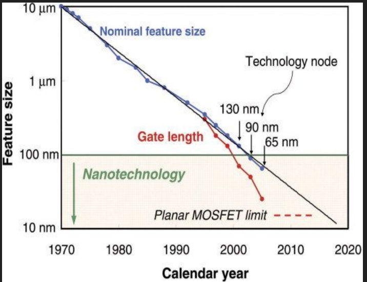

## Ultima Generación

* SSI: integración a pequeña escala (10 a 100 componentes por chip).

* MSI: integración a mediana escala (100 a 1.000 componentes).

* LSI: integración a gran escala (1.000 a 10.000).

* VLSI: integración a muy gran escala (>10.000) → Intel 4004.

### Microprocessor timeline

* 1971 – Intel 4004 – 4 bits.

* 1972 – Intel 8008 – 8 bits.

* 1974 – Intel 8080 – 8 bits.

* 1978 – Intel 8086 – 16 bits.

* 1982 – Intel 80286 – 16 bits.

* 1985 – Intel 386 – 32 bits.

* … (otros posteriores).

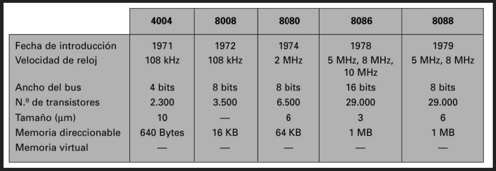
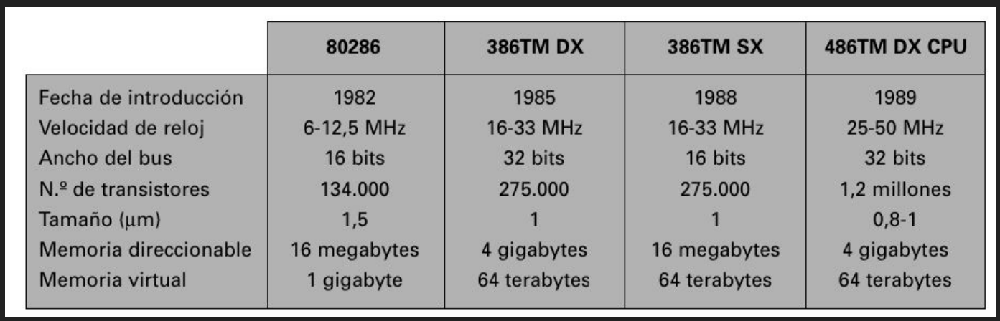
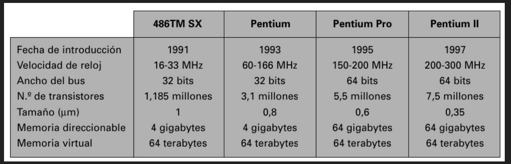
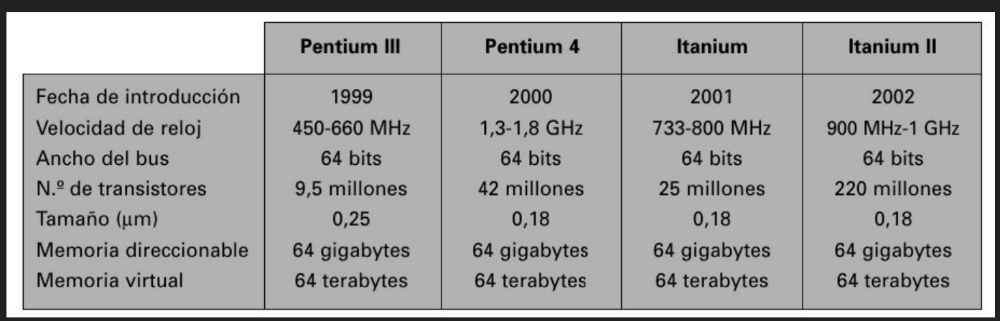
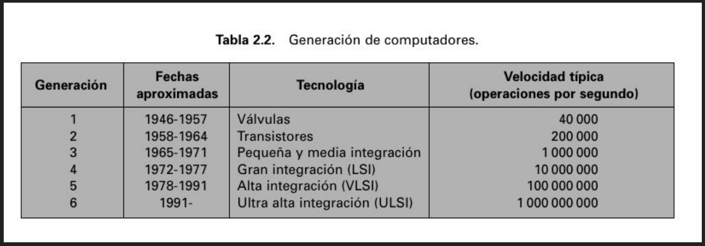

### Arquitectura de Computadora

* ISA (arquitectura de conjunto de instrucciones): interfaz del programador.

    * Clases: registro-memoria, load-store.

    * Direccionamiento de memoria.

    * Modos de direccionamiento.

    * Tipos y tamaños de operandos.

    * Operaciones.

    * Instrucciones de control de flujo.

    * Codificación.

* Componentes de hardware.

* Organización (microarquitectura).

## Tendencias en el rendimiento

* Rendimiento de procesadores:

    * Tamaño de la tecnología / frecuencia de reloj.

        * Densidad de potencia.

        * Retardo.

    * Técnicas de microarquitectura.

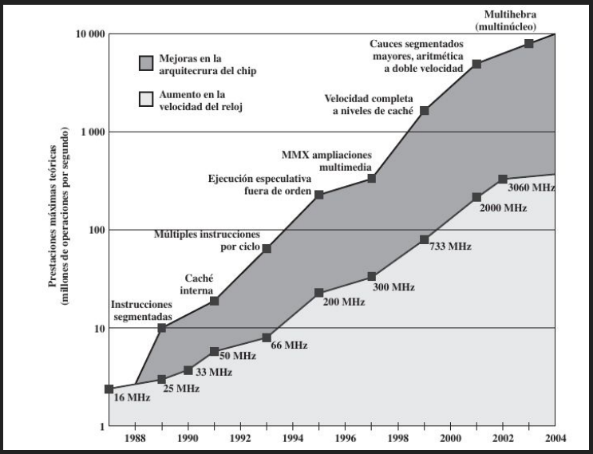

### Tendencias en la tecnología: ancho de banda vs latencia.
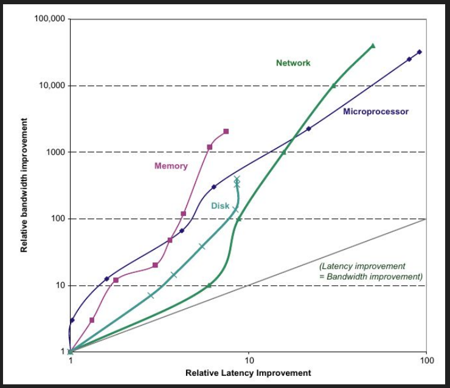

### Tendencias en la tecnología: escalado de transistores.
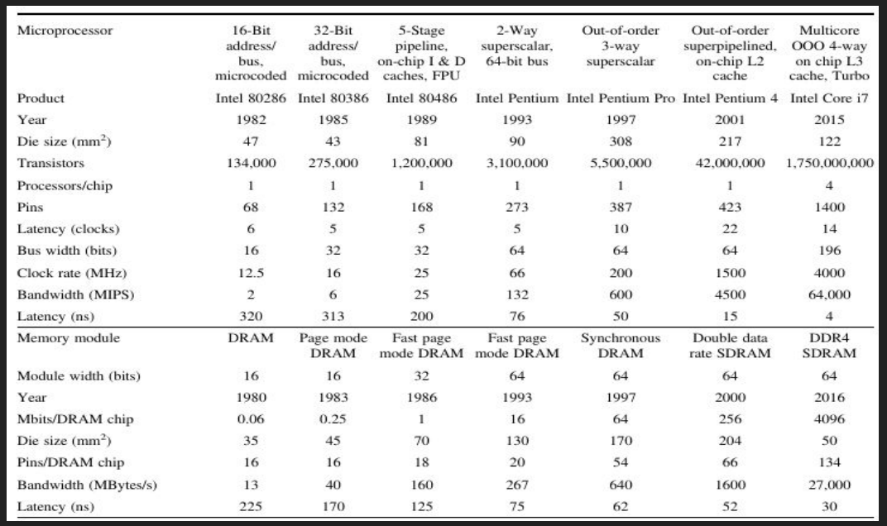
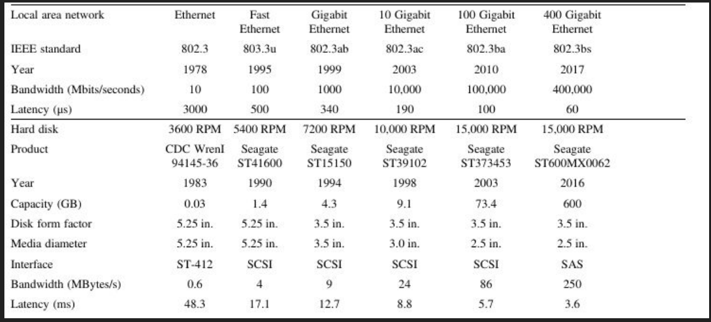

### Tendencias en potencia y energía
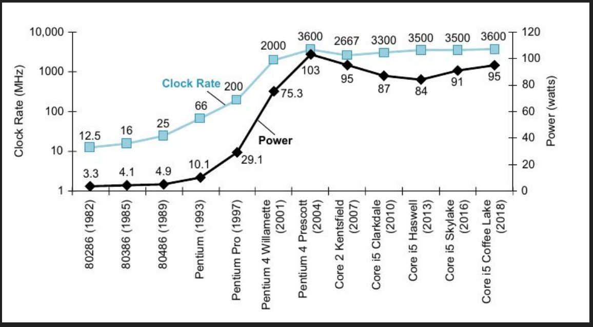

Energía dinámica = C × V² (cambio de 0→1→0; 1→0→1).

Energía dinámica = ½ × C × V² (transición 0→1 o 1→0).

Potencia dinámica = ½ × C × V² × Frecuencia.

* Ejemplo: Intel 80386 ≈ 2W, Intel Core i7-6700K 4.0 GHz ≈ 95W.

* Dado que este calor debe disiparse en un chip de 1,5 cm de lado, se llega al límite de lo enfriable por aire.

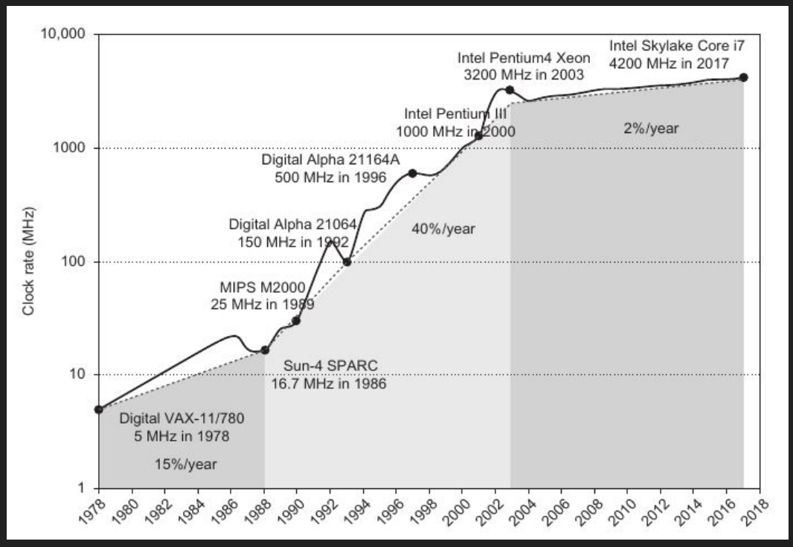

### Técnicas para mejorar la eficiencia energética

* Hacer nada bien.

* Escalado dinámico de voltaje-frecuencia.

* Diseñar para el caso típico.

* Overclocking.

### Potencia Estatica

`Potencia estática = Corriente de fuga × Voltaje.`

* La corriente de fuga fluye incluso cuando un transistor está apagado.

* La potencia estática es proporcional al número de dispositivos.

    → “apagado por bloques” (power gating).

### Medición del rendimiento

Cuando decimos que una computadora es más rápida que otra, ¿qué queremos decir?

¿Tiempo de ejecución? ¿Rendimiento (throughput)?

### Benchmarks

* Programas usados por muchas compañías para establecer el rendimiento relativo.

* SPEC (Standard Performance Evaluation Corporation) – spec.org
.

* SPEC CPU2017: 10 benchmarks enteros (CINT2017) y 17 de punto flotante (CFP2017).

* Programas reales portados, con mínimo efecto de E/S.

* Enteros: compilador C, juego de Go, compresión de video.

* Punto flotante: dinámica molecular, ray tracing, pronóstico meteorológico.

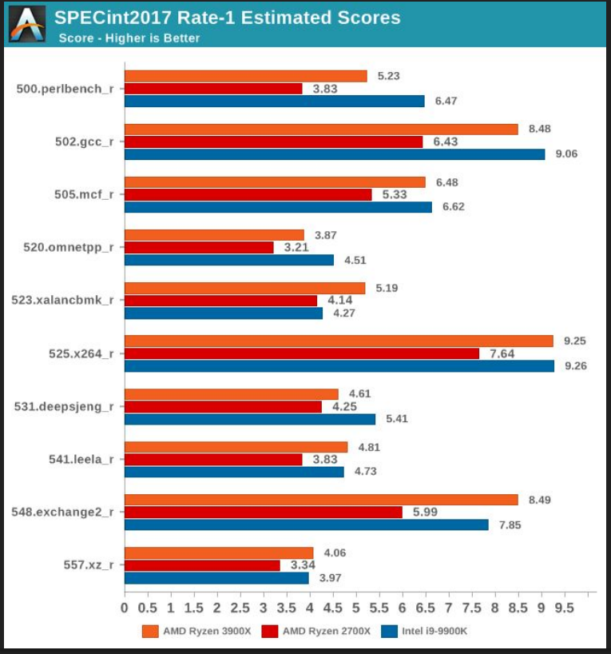
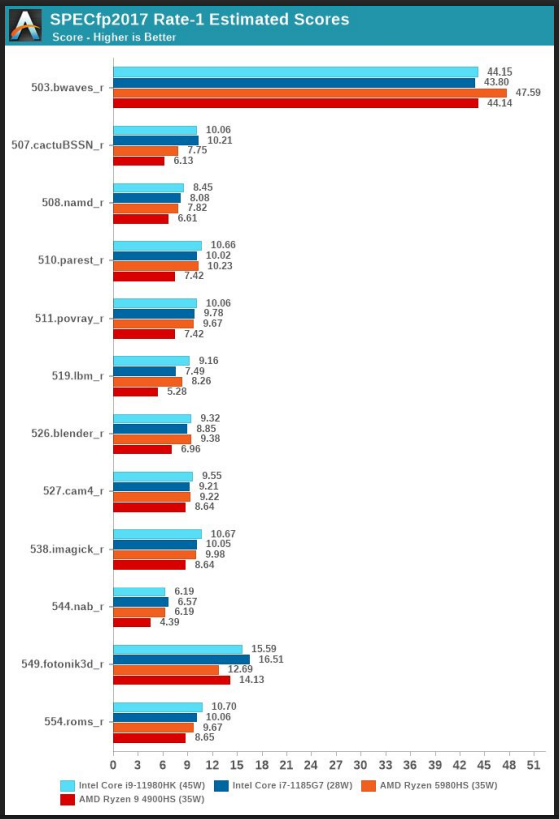

### Ley de Amdahl

* La ganancia de rendimiento al mejorar parte de un sistema se calcula con la Ley de Amdahl.

* La mejora está limitada por la fracción del tiempo en que puede usarse el modo más rápido.

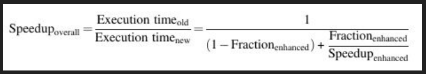

* Si la mejora aplica solo a una fracción de la tarea, no se puede acelerar más que el recíproco de 1 menos esa fracción.

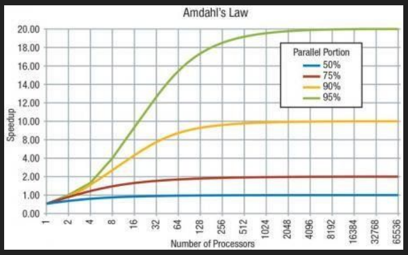

### Ecuación de rendimiento del procesador

* El tiempo de CPU de un programa se puede expresar de dos maneras:

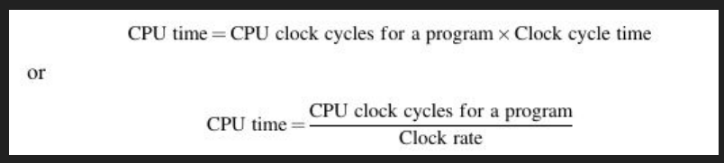

* Conociendo ciclos de reloj e instrucciones, se calcula el CPI promedio.

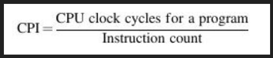

* Transponiendo el conteo de instrucciones en la fórmula anterior, los ciclos de reloj se pueden definir como IC CPI.

    * Fórmula: Ciclos de reloj = IC × CPI.

    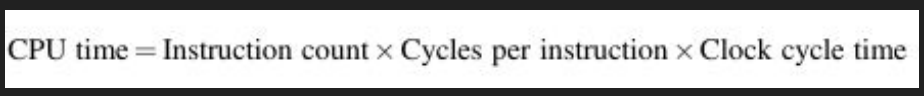

* Expansión muestra que el rendimiento depende de tres características:

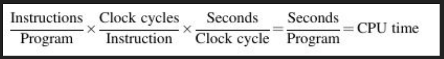

* El rendimiento del procesador depende de tres características: ciclo de reloj (o frecuencia), ciclos de reloj por instrucción y número de instrucciones.

    * Ciclo de reloj (frecuencia).

    * Ciclos por instrucción (CPI).

    * Número de instrucciones (IC).

