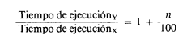
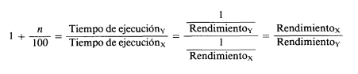
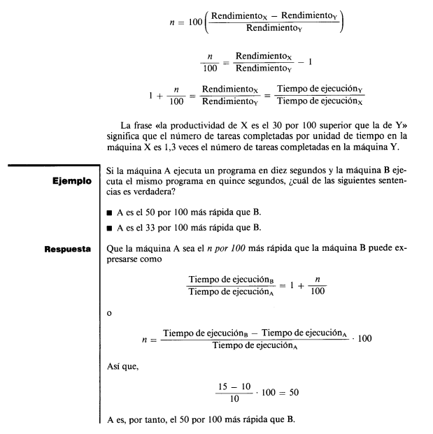
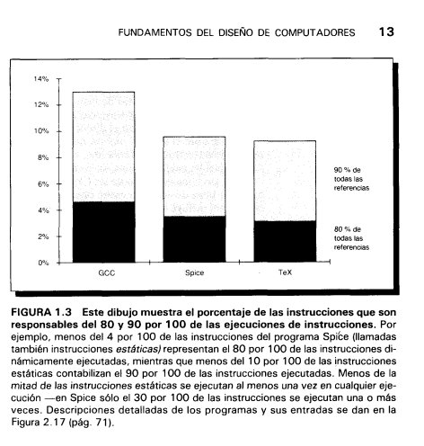

# Fundamentos del Diseño de Computadores

Mientras que las mejoras tecnológicas han sido bastante
constantes, el progreso en la obtención de mejores arquitecturas ha sido mucho menos consistente.

Durante los veinte últimos años, los diseñadores de computadores han dependido enormemente de la tecnología de circuitos integrados. El crecimiento del
rendimiento durante este período varia del 18 al 35 por 100 por año, dependiendo de la clase de computador.

# Definiciones de Rendimiento

Para familiarizar al lector con la terminología y conceptos de este libro, este
capítulo introduce algunos términos e ideas clave. Ejemplos de las ideas mencionadas aquí aparecen a lo largo del libro, y algunas de ellas -segmentación
(pipelining), jerarquía de memoria, rendimiento de la CPU y medida de costes- son el núcleo de capítulos completos. Comencemos con definiciones de
rendimiento relativo.

Cuando se dice que un computador es más rápido que otro, ¿qué queremos significar? El usuario del' computador puede decir que un computador es
más rápido cuando ejecuta un programa en menos tiempo, mientras que el
director de un centro de cálculo puede decir que un computador es más rápido cuando completa más tareas en una hora. El usuario del computador está interesado en reducir el tiempo de respuesta -el tiempo transcunido entre el
comienzo y el final de un evento- denominado también `tiempo de ejecución`
o `latencia`. El director del centro de cálculo está interesado en incrementar la
`productividad (throughput)` -la cantidad total de trabajo realizado en un
tiempo determinado- a veces denominado `ancho de banda`. Normalmente,
los términos `«tiempo de respuesta», «tiempo de ejecución» y «productividad»`
se utilizan cuando se está desarrollando una tarea de cálculo completa. Los
términos de `latencia y «ancho de banda»` casi siempre se eligen cuando se habla de un `sistema de memoria`.

### EJEMPLO

¿Las siguientes mejoras en rendimiento incrementan la productividad, hacen disminuir el tiempo de respuesta, o ambas cosas?

1. Ciclo de reloj más rápido. 
 
2. Múltiples procesadores para tareas separadas (tratamiento del sistema de reservas de una compañía aérea, para un país, por ejemplo).

3. Procesamiento paralelo de problemas científicos.

`RESPUESTA:` La disminución del tiempo de respuesta, habitualmente, mejora la productividad. Por consiguiente, 1 y 3 mejoran el tiempo de respuesta y la productividad. En 2, ninguna tarea funciona más rápida, por tanto, sólo incrementa
la productividad. 

### RENDIMINETO

Cuando se comparan alternativas de diseño, con frecuencia, queremos relacionar el rendimiento de dos máquinas diferentes, por ejemplo X e Y. La frase «X es más rápida que Y» se utiliza aquí para significar que el tiempo de
respuesta o tiempo de ejecución es inferior en X que en Y para una tarea dada.
En particular, «X es n por 100 más rápido que Y» significa 

Como el tiempo de ejecución es el recíproco del rendimiento, se mantiene la
siguiente relación: 

Algunas personas consideran un incremento en el rendimiento, n, como la diferencia entre el rendimiento de la máquina más rápida y la más lenta, dividido por el rendimiento de la máquina más lenta. Esta definición de n es exactamente equivalente a nuestra primera definición, como podemos ver: 

---

### Rendimiento, tiempo de ejecución y segmentación (pipelining)

El **rendimiento** y el **tiempo de ejecución** son inversos entre sí:  
- Si **aumentamos el rendimiento**, automáticamente **disminuye el tiempo de ejecución**.  
- Para evitar confusiones, solemos hablar de **“mejorar el rendimiento”** o **“mejorar el tiempo de ejecución”** (ambas expresiones significan lo mismo: más rápido).

---

### Productividad vs Latencia

En el diseño de computadores entran en juego dos conceptos diferentes:  
- **Productividad (throughput):** cuántas instrucciones o tareas completas puede ejecutar la máquina en un período de tiempo.  
- **Latencia:** cuánto tarda en completarse una sola instrucción o tarea.  

Estos dos valores no siempre cambian en la misma dirección.

---

### Segmentación de instrucciones (pipelining)

La **segmentación** divide la ejecución de una instrucción en varias etapas, 
permitiendo **solapar la ejecución de múltiples instrucciones** al mismo tiempo.  

Un ejemplo clásico es la **línea de ensamblaje de autos**:  
- Fabricar un coche entero puede llevar 8 horas.  
- Si dividimos el proceso en 8 etapas de 1 hora, entonces **cada hora sale un coche terminado**, porque hay 8 en construcción simultánea.  

👉 En este caso:  
- La **latencia** para fabricar un coche **sigue siendo 8 horas**.  
- La **productividad aumenta**: ahora se completa 1 coche por hora, no 1 cada 8 horas.

---

### En los computadores

- El pipelining **no reduce la latencia de una instrucción individual**.  
- Pero sí **incrementa el número de instrucciones completadas por unidad de tiempo** (mayor rendimiento).  
- Cada etapa del cauce introduce un pequeño **gasto adicional (overhead)**, lo que puede aumentar ligeramente la latencia total.

---

### Resumen

- **Mejorar rendimiento = reducir tiempo de ejecución.**  
- **Latencia ≠ productividad.**  
- El **pipelining** no acelera instrucciones individuales, pero **permite terminar más instrucciones por segundo** gracias al paralelismo.
---

# Principios Cuantitativos del Diseño de Computadores

## 1. Acelerar el caso común
El principio más importante del diseño de computadores es **optimizar el caso frecuente**.  
- Cuando diseñamos, conviene favorecer lo que ocurre con más frecuencia en lugar de lo raro.  
- Mejorar lo que pasa seguido tiene más impacto en el rendimiento global.  
- Muchas veces, lo común es más **simple** y se puede **optimizar mejor**.

**Ejemplo:**  
Al sumar dos números en la CPU puede ocurrir un *desbordamiento* (overflow), pero eso es poco común.  
- En lugar de diseñar la CPU pensando en ese caso raro, conviene optimizar la suma normal (que ocurre siempre).  
- Así, el rendimiento global mejora, porque el caso común se hace más rápido.

---

## 2. Ley de Amdahl
La **Ley de Amdahl** nos dice cuánto puede mejorar el rendimiento de un sistema cuando optimizamos solo una parte de él.  

- **Idea central:**  
  * La mejora global está limitada por la fracción de tiempo en que podemos aplicar la mejora.  
  * Si la mejora aplica solo a un 40% del tiempo de ejecución, no podemos acelerar el programa más allá de cierto límite.

**Definición de aceleración (speedup):**

$$
\text{Aceleración} = \frac{\text{Tiempo ejecución sin mejora}}{\text{Tiempo ejecución con mejora}}
$$

---

### Ejemplo: Viaje de Nevada a California
- Se tarda **20 horas** en cruzar las montañas (tiempo fijo).  
- Luego hay **200 millas** que se pueden recorrer con distintos medios de transporte.  

Opciones para la segunda parte del viaje:  
1. A pie → 4 mph → 50 h.  
2. Bicicleta → 10 mph → 20 h.  
3. Auto Hyundai → 50 mph → 4 h.  
4. Ferrari → 120 mph → 1,67 h.  
5. Vehículo oruga → 600 mph → 0,33 h.  

**Conclusión:**  
Aunque mejores mucho la segunda parte (usar un Ferrari o un vehículo oruga), el tiempo total sigue dominado por las **20 horas de las montañas**.  
La aceleración global siempre está limitada por la parte que **no mejora**.

---

### Fórmula de Amdahl
Si una fracción del programa es mejorada, la aceleración global es:

$$
\text{Aceleración global} = \frac{1}{(1 - F_{mejorada}) + \frac{F_{mejorada}}{A_{mejorada}}}
$$

Donde:  
- \(F_{mejorada}\) = fracción de tiempo mejorable.  
- \(A_{mejorada}\) = aceleración en la parte mejorada.

**Ejemplo numérico:**  
- La mejora se usa en el 40% del tiempo (\(F_{mejorada} = 0.4\)).  
- La parte mejorada es 10 veces más rápida (\(A_{mejorada} = 10\)).  

$$
\text{Aceleración global} = \frac{1}{0.6 + \frac{0.4}{10}} = \frac{1}{0.64} \approx 1.56
$$

---

## 3. Coste/Rendimiento
No siempre conviene mejorar una parte si el **coste** supera la ganancia de rendimiento.  

**Ejemplo:**  
- Si mejorar la CPU ×5 cuesta más del doble del precio total del sistema, puede que la inversión no valga la pena.  
- Lo importante es evaluar la **relación coste/rendimiento**.

---

## 4. Localidad de Referencia
Otro principio básico en el diseño de computadores es la **localidad**:  
Los programas tienden a **reutilizar datos e instrucciones recientes**.  

Tipos de localidad:  
- **Temporal:** lo usado recientemente se volverá a usar pronto.  
- **Espacial:** lo que está cerca en memoria tiende a usarse en conjunto.  

**Ejemplo:**  
Un programa puede pasar el 90% de su tiempo ejecutando solo el 10% de sus instrucciones.  
Esto permite predecir y optimizar qué datos o instrucciones se van a usar en el futuro.

---

## 5. Gráfico de referencias
Un estudio de programas reales (GCC, Spice, TeX) mostró que:  
- El **80–90% de todas las referencias** se concentran en **menos del 10% de las instrucciones**.  
- Esto confirma que los programas usan **un pequeño conjunto de instrucciones muchas veces** (gran localidad).

